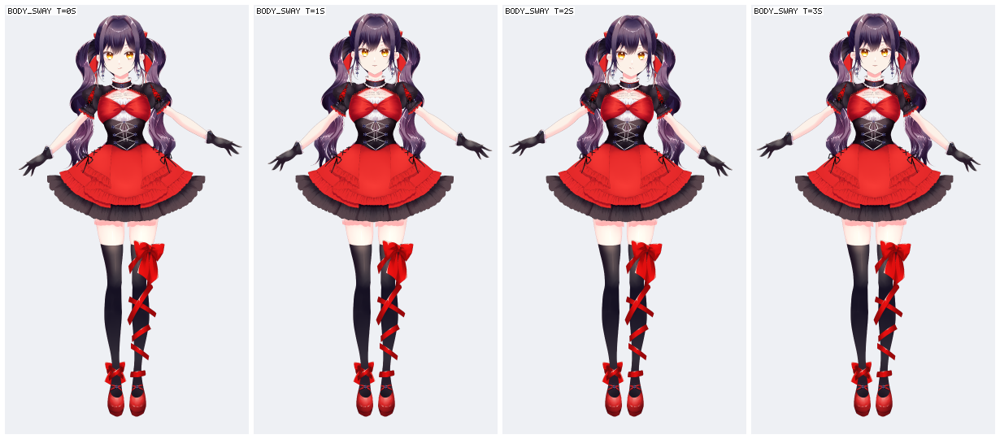
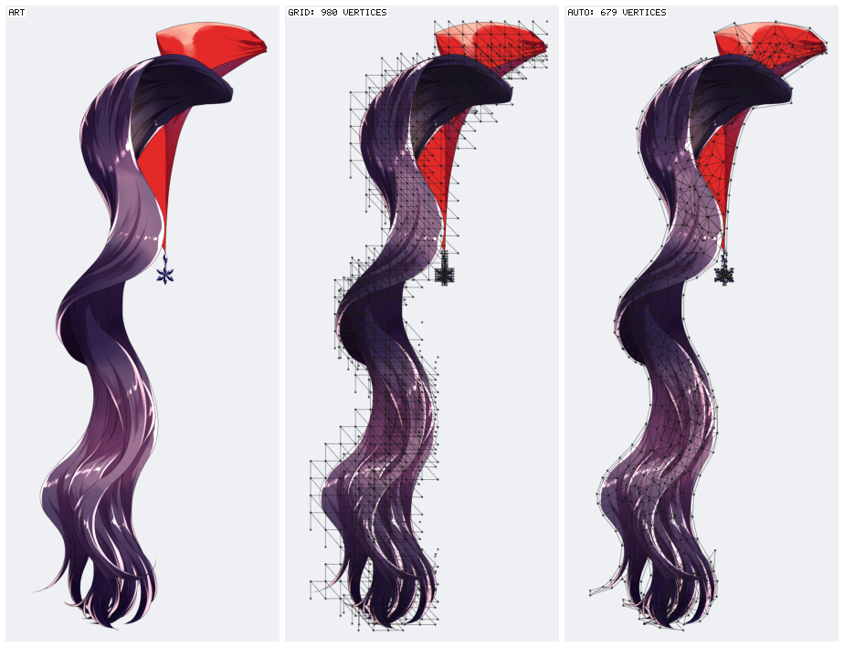
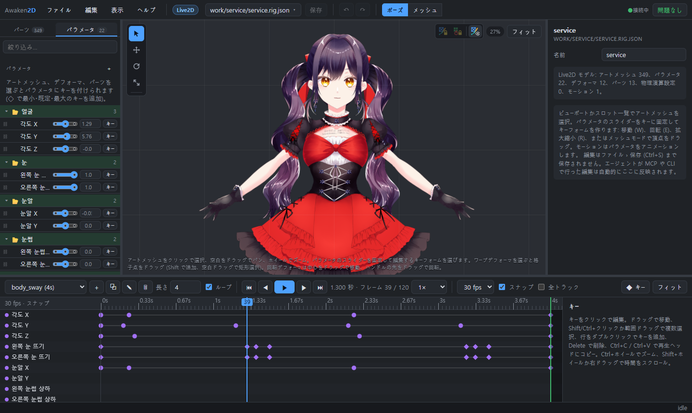
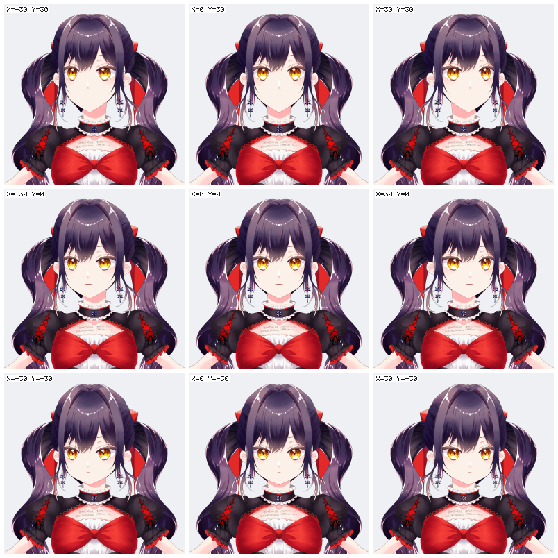
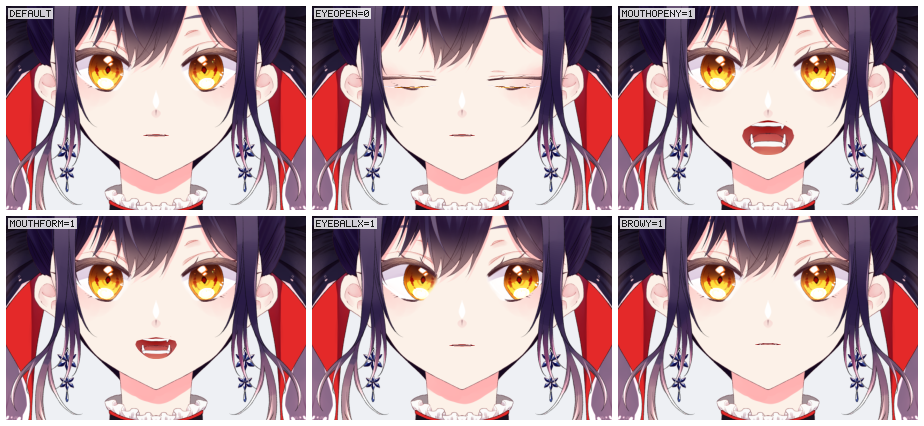
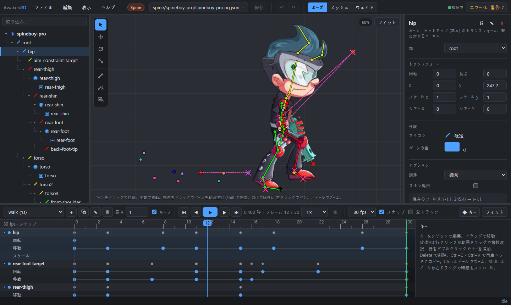
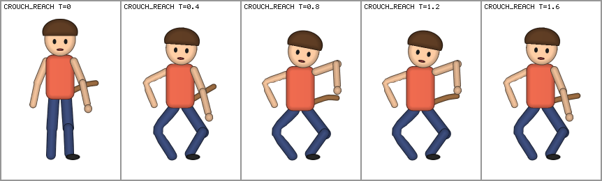
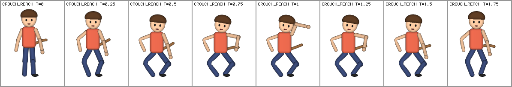

# Awaken2D

[English](README.md) · [한국어](README.ko.md) · **日本語**

Spine・Live2D 系の 2D リギング・アニメーションツールキットです。AI エージェントが人と同じくらい簡単にリグを読み、
編集し、目で確かめられることを目指しています。

- モデルはテキストファイルです。
- 編集は宣言的な op で行います。
- 結果はヘッドレスレンダラーで確認します。
- 人は同じファイルを Web エディタで編集します。
- Spine・Live2D のデータを読み込み、書き戻せます。



## 目次

- [機能](#機能)
- [クイックスタート](#クイックスタート)
- [アートの読み込みと自動メッシュ](#アートの読み込みと自動メッシュ)
- [Live2D](#live2d)
- [Spine](#spine)
- [エディタ](#エディタ)
- [MCP](#mcp)
- [デモキャラクター (ボーン、IK、物理演算)](#デモキャラクター-ボーンik物理演算)
- [フォルダ構成](#フォルダ構成)
- [ロードマップ](#ロードマップ)

## 機能

| | |
|---|---|
| **テキストのモデル形式** | `*.rig.json` にボーン、スロット、ウェイト付きメッシュ、パラメータ、アニメーションが入ります。diff がきれいに取れます。仕様は [docs/FORMAT.md](docs/FORMAT.md) (`rig spec` で表示) にあります。 |
| **宣言的な op** | すべての編集は op です。アトミックに適用され、失敗すると正確なエラーメッセージを返します。例: `addBone` はワールド座標の `start`/`end` を取り、`addMesh` は矩形・楕円・多角形からメッシュを作ってウェイトも自動で付けます。`setKeys` はキーを打ちます。CLI・MCP・エディタは同じ op を使います。 |
| **ヘッドレスレンダラー** | 決定的なソフトウェアラスタライザで PNG を出力します。ボーン・名前・メッシュ・デフォーマ・グルーのオーバーレイ、アニメーションのコンタクトシート、パラメータシートを描けるので、エージェントが結果を自分で見て確かめられます。 |
| **バリデータ** | 構造を検査したうえで、全アニメーションをサンプリングして折れた三角形や NaN を見つけます。 |
| **2 種類のターゲット** | モデルは Spine モデル (ボーン、ウェイト、スキン、コンストレイント) か Live2D モデル (パラメータ、キーフォーム、デフォーマ、パーツ) のどちらかです。もう一方の op は拒否され、エディタもその種類のツールだけを表示します。 |
| **Spine 連携** | Spine 3.8/4.x のエクスポートを読み込み、書き戻します。ポーズは公式 Spine 4.3 ランタイムと一致します。編集せずに往復すれば元のデータがそのまま戻ります。 |
| **Live2D 連携** | Cubism モデル (model3 + moc3、モーション、物理、ポーズ) を読み込み、moc3 + JSON で書き出します。公式 Cubism Core とフレーム単位で一致します。 |
| **アートの読み込み** | PSD/PSB・PNG のレイヤーがスロットになり、絵に沿ってトレースしたメッシュが付きます。メッシュの密度はレイヤーの大きさ・形・名前から決めます。 |
| **Web エディタ** | ギズモ、メッシュ・ウェイト編集、パラメータのキーフォーム、ドープシート形式のタイムライン、取り消し。エージェントがファイルを編集するとすぐに反映されます。UI は英語・韓国語・日本語です。 |
| **MCP サーバー** | 読み込み、編集、検証、レンダリング、書き出しをすべてツールとして提供します。 |

ランタイム依存はありません。TypeScript をビルドなしで Node ≥ 23.6 で直接実行します。

## クイックスタート

```bash
npm install
npm run example
```

```bash
npm run rig -- describe examples/mascot/mascot.rig.json
```

```bash
npm run rig -- sheet examples/mascot/mascot.rig.json --anim walk --frames 8 -o out/walk.png
```

```bash
npm run rig -- render examples/mascot/mascot.rig.json --overlay bones,names,mesh -o out/setup.png
```

ファイルに書いた op を適用します (`-` を渡すと stdin から読みます):

```bash
npm run rig -- apply my.rig.json ops.json
```

引数なしの `npm run rig` でコマンド一覧が表示されます。

## アートの読み込みと自動メッシュ

```bash
npm run rig -- import art.psd out/model.rig.json --target live2d
```

PSD/PSB・PNG のレイヤー 1 枚が、テクスチャ付きメッシュを持つスロット 1 つになります。

- ブレンドモードは保持され、クリッピングマスクは焼き込まれます。
- 縮小して読み込めます。
- `--propose` を付けると、レイヤー名 (英語・韓国語) と形からスケルトンも提案します。

メッシュはグリッドではなく、絵の輪郭に沿ってトレースします。頂点数はレイヤーごとに決めます:

| レイヤーの種類 | メッシュ |
|---|---|
| 小さなパーツ、瞳、ボタン | 輪郭のみ |
| 顔、手、足 | 標準的な密度 |
| 髪、服、スカート、手足、細長い形 | 長さ方向に細かく |

- 判断材料: レイヤー名・グループのパス (英語・日本語・韓国語) と絵の形。
- どのメッシュも絵を漏れなく覆っているか検査します。
- Live2D ターゲットではより細かくなります。



便利なオプション:

- `--mesh-density K`: 頂点数の倍率。
- `--mesh-role hair=flexible,...`: レイヤーの役割を指定。
- `--mesh grid` (または `--spacing PX`): 従来のグリッドメッシュ。

既存のメッシュを作り直すには `rig remesh <model> --all --plan` を使います。エディタではメッシュモード › *自動…* です。

## Live2D

```bash
npm run rig -- live2d-import model/name.cmo3 out/name.rig.json
npm run rig -- live2d-export out/name.rig.json export/
```

- **読み込み**: Cubism Editor のモデル (.cmo3) を読みます。パラメータ、パーツ、デフォーマ、アートメッシュ、グルー、
  ブレンドシェイプ、変形パス、物理演算、名前、非表示・ロック状態、テクスチャアトラス。隣にあるアニメーションファイル
  (.can3) のモーションも読みます。
- **評価**: Cubism と同じ計算をします。
  - キーフォーム、ブレンドシェイプ (4.2+)、ワープ・回転デフォーマ、パーツ、グルー、描画順グループをそのまま保持します。
  - ポーズは公式 Cubism Core と一致し、ローカルのツールでフレーム単位で比較しています。
  - モーション・物理・ポーズのフェードは Cubism Framework と同じように再生されます。
- **編集 (Cubism 方式)**:
  1. アートメッシュを選びます。
  2. パラメータ一覧の ◇ で最小・既定・最大のキーを追加します。
  3. スライダー下のキーの点をクリックし、ギズモや頂点で形を作ります。
  4. デフォーマも同じです: ワープデフォーマを選んで格子点をドラッグ (選んだ点は移動・回転・拡縮ツールで変形)、回転
     デフォーマは中心かハンドルをドラッグします。
  5. 選んだオブジェクトのパネルに、キーと固定したスライダーでのキーフォームが出ます: 描画順、乗算/スクリーン色と不透明度、
     回転デフォーマの角度・倍率・反転、グルーの強さ。パーツ・デフォーマ一覧の ＋ でパーツや、選んだオブジェクトを囲む
     ワープ/回転デフォーマを作ります。
- **組み合わせ**: オブジェクトを 2〜3 個のパラメータにそれぞれキー付けすると (各パラメータの ◇)、キーのすべての組み合わせに
  キーフォームができます。パラメータ左のチェーンで下のパラメータと連結すると 1 つの 2D 操作になり (Cubism の
  AngleX × AngleY のように)、選択中のオブジェクトのキーフォームが赤い点で表示されます。
- **パーツ・デフォーマの一覧**: 行を右クリックすると、展開/折りたたみ (すべても)、表示/非表示、ロック、名前の変更、
  削除、パーツやそれを囲むワープ/回転デフォーマの追加ができます。
- **パラメータシート**: パラメータが何を動かすかを 1 枚で見せます。
  `rig param-sheet <model> --param ParamAngleX --param2 ParamAngleY --steps 3`。







## Spine

```bash
npm run rig -- spine-import skeleton.json out/skeleton.rig.json
npm run rig -- spine-export out/skeleton.rig.json export/
```

- **読み込み・書き出し**:
  - Spine 3.8/4.x のエクスポート (JSON + アトラス) を読み込みます。
  - Spine 4.x の JSON + アトラス + 画像で書き出します。Spine の Import Data でそのまま開けます。
- **Spine と同じ評価**:
  - ボーンの inherit モード;
  - スキン (スキンボーン・コンストレイントを含む);
  - リンクメッシュ;
  - クリッピング・バウンディングボックス;
  - 2 色ティント;
  - IK / トランスフォーム / パス / 物理 / スライダーのコンストレイント (Spine の順序どおり);
  - それぞれのタイムライン。

  Spine のサンプルでは、物理を含めて公式 Spine 4.3 ランタイムと約 0.05 単位以内で一致します。
- **正確な往復**: 編集していないデータは読み込んだときのまま書き戻されます。
- **イベントサウンド**:
  - エディタで再生されます (🔇 でミュート)。
  - ツリーのイベントセクションでサウンドの有無が分かります。
  - *サウンドファイルを選ぶ…*: wav/ogg/mp3 をモデルの隣にコピーしてイベントにリンクします。
  - 書き出し時にサウンドもコピーされます。
- **リージョンアタッチメント**: Spine と同じく四角形のままです。`--mesh auto` を付けると自動メッシュになります。
- **エディタのツリー** (Spine のツリーと同じ構成): スケルトン (ボーン、スロット、アタッチメント)、続いてコンストレイント、
  描画順、スキン、イベント、アニメーション、画像、オーディオ。
  - 行の右クリック: 展開/折りたたみ (すべても)、名前の変更、複製、削除、新規追加、スキンの有効化、スロットの
    アタッチメントの表示/非表示。
  - コンストレイント、描画順、スキン、イベント、アニメーションはフォルダに入れられます。Spine と同じく、フォルダは名前の
    一部です (`accessories/bag`)。セクションの右クリック › *新規フォルダー…*、項目の右クリック › *フォルダーへ移動…*、
    フォルダの右クリックで名前の変更、中身の取り出し、削除。
  - ボーンには Spine のボーンアイコンを付けられます。アニメーションを開くと、パネルから IK のミックス/ベンド、描画順、
    デフォームにキーを打てます。



## エディタ

```bash
npm run editor
```

http://127.0.0.1:5178/ を開きます。別のフォルダのモデルを編集するには `-- --root <フォルダ>` を付けます。サーバーは
localhost でのみ待ち受け、root 以下のファイルだけを読み書きします。

**ファイルと保存**
- ファイルを開く: ヘッダーのファイル名、またはファイル › 開く (Ctrl+O)。
- ファイルメニューにはほかに:
  - Spine / Live2D の読み込み・書き出し;
  - 保存 (Ctrl+S);
  - 名前を付けて保存 (Ctrl+Shift+S。画像のパスは新しいフォルダに合わせて書き換えられます);
  - 保存した状態に戻す。
- 開くの一覧では各モデルに Spine / Live2D の表示が付きます。モデルを右クリックすると削除できます。そのモデルだけが使っていた画像と一緒に `.awaken2d-trash/` へ
  移動します。
- 保存するまで、編集はサーバー上の作業コピーに入ります。
  - ● は未保存のファイルです。
  - ページを再読み込みしても作業コピーは残ります。
  - *編集ごとに自動保存* (または `serve --autosave`) にすると、編集のたびにディスクへ書き込みます。
- 作業中にエージェントがファイルを編集した場合:
  - 未保存の編集がなければ自動で読み直します。
  - あればバナーが出ます: *ディスクの版を読み込む* または *自分の編集を保持*。*自分の編集を保持* を選ぶと、次の保存で
    ディスクの版を上書きします。
- パス (開く、読み込み、書き出し、名前を付けて保存) は入力せず、ファイル選択ダイアログで選びます。

**ポーズとアニメーション**
- ツール:
  - 選択 `Q`、移動 `W`、回転 `E`、拡大縮小 `R`。ギズモには軸の矢印、リング、軸のボックス、均等拡大用の中心点が
    あります。
  - 新規ボーン `B`: 関節から先端へドラッグします。新しいボーンの下のメッシュをバインドするかダイアログで尋ねます。
    Shift を押すとスナップします。
- 補正 (Spine と同じ、セットアップのみ):
  - 画像の補正 (`T`): オンにするとボーンを動かしても絵はそのまま。スケルトンを絵に合わせるときに使います。
  - ボーンの補正 (`Shift+T`): オンにするとボーンを動かしても子ボーンはそのままです。
- セットアップ (アニメーション未選択) では、編集は基本ポーズを変えます。アニメーションを選ぶと、再生ヘッドの位置に
  キーを打ちます。`K` は選択中のボーンの現在のポーズをキーにします。
- タイムライン (ドープシート):
  - アニメーションのチャンネルごとに 1 行。グループにまとまり、折りたためます。
  - 範囲選択でキーを選んでドラッグします。フレームグリッド (24/30/60 fps) にスナップします。キーのコピー・貼り付け
    もできます。
  - イージング: リニア、ステップ、イーズイン/アウト、カーブのプレビュー付きのカスタムベジェ。キーの形でイージングが
    分かります。
  - 上のバーで長さとループを設定し、アニメーションを複製・名前変更・削除します。
- プロパティ: フィールド名をドラッグすると値が変わります (Shift で微調整)。パーツには色、不透明度、ブレンド、
  クリッピング、描画順があります。

**メッシュとウェイト**
- メッシュモード (`2`、Spine 方式):
  - *修正*: 頂点を動かす。*作成*: 頂点を追加。*削除*: 頂点を消す。
  - *自動…*: インポーターと同じ自動メッシュ。役割と密度を調整できます。
  - *トレース…*: 絵の輪郭に沿ってメッシュを作ります。
  - *生成*: 輪郭の内側を均等な間隔の頂点で埋めます。
  - *リセット*: 画像の矩形に戻します。
  - どれもリアルタイムでプレビューされます。ウェイト、キーフォーム、デフォームキーは引き継がれます。
  - Spine のアニメーションを開いていると、頂点のドラッグは再生ヘッドにデフォームキーを打ちます (Spine のアニメートモードと
    同じ)。スロットの前へ/後ろへボタンは描画順を、IK コンストレイントのパネルは mix と曲げをキーします。
- Live2D アートメッシュのメッシュモード (Cubism 方式):
  - *キーフォームの形状*: 固定したキーのキーフォームの形を作ります。
  - *メッシュ編集*: メッシュそのものを編集します。すべてのキーフォームが追従します。*メッシュ自動生成…* (Cubism の
    メッシュ自動生成のプリセット)、*自動接続*、*4 分割* を含みます。
- ウェイトモード (`3`):
  - *直接*: 選択した頂点に値を入力。
  - *ブラシ*: 加算、減算、値に設定、スムーズ。
  - *スムーズ*、*自動*、*入れ替え…*、*整理* は選択範囲かメッシュ全体に適用されます。
  - ヒートマップは選んだボーンのウェイトを、パイ表示は頂点ごとに全ボーンのウェイトを表示します。

**共通**
- 階層の行を右クリックすると、その操作のメニューが出ます。名前の変更: F2。削除: Shift+Del (確認あり)。ボーンを削除すると、子とウェイトは親ボーンが引き継ぎます。
- 取り消し・やり直し (Ctrl+Z / Ctrl+Shift+Z) はエディタ外の編集も対象です。エージェントの変更も UI から取り消せます。
- Space で再生・一時停止、`F` で全体表示。ヘルプ › キーボードショートカットにすべてのキーの一覧があります。
- UI の言語: English、한국어、日本語 (ヘルプ › 言語)。ボーン・スロット・パラメータ・ファイルの名前は翻訳しません。
- ブラウザが TypeScript のコアを直接実行します。サーバーがその場で型を取り除くので、ビルドは不要です。

## MCP

このフォルダの `.mcp.json` が Claude Code にサーバーを登録します。ほかのクライアントでは:

```json
{ "command": "node", "args": ["--disable-warning=ExperimentalWarning", "<repo>/src/mcp/server.ts"] }
```

| ツール | |
|---|---|
| モデル | `rig_spec`, `rig_new`, `rig_describe`, `rig_validate`, `rig_apply` |
| 確認 | `rig_render`, `rig_sheet`, `rig_param_sheet` |
| 読み込み | `rig_import`, `rig_propose_bones`, `rig_spine_import`, `rig_live2d_import` |
| 書き出し | `rig_spine_export`, `rig_live2d_export` |

エージェントの典型的な流れ:

1. `rig_spec`
2. `rig_new` または読み込みツール
3. `rig_apply` (`preview` 付き)
4. `rig_validate`
5. `rig_sheet`
6. 3 から繰り返し。

## デモキャラクター (ボーン、IK、物理演算)

`npm run example:character` は Spine のデモを作り直します。

1. PSD を描きます。
2. スケルトンの提案付きで読み込みます。
3. IK、物理演算、アニメーションを追加します。

```bash
npm run rig -- import examples/psd-demo/character.psd out/character.rig.json --target spine --propose --ik --physics
```

- **IK** (`--ik`): 腕と脚に 2 ボーン IK が付きます。腰を下げても足は接地したままです。手のターゲットをワールド座標で
  キーにすると腕が追従します ([animate.ops.json](examples/psd-demo/animate.ops.json))。

  
- **物理演算** (`--physics`): しっぽが 3 ボーンのチェーンになり、各ボーンに Spine の物理コンストレイントが付きます。
  キーなしで、腰の動きだけで揺れます。慣性、強さ、減衰、質量、風、重力を設定でき、キーにもできます。

  

## フォルダ構成

```
src/core     形式の型、数学、ポーズ/スキニング、アニメーション、ジオメトリ、自動ウェイト、メッシュプランナー、検証、op、
             Spine ランタイムの移植 (spine.ts)、Live2D の評価 (live2d*.ts)
src/import   PSD リーダー/ライター、レイヤーの読み込み、スケルトンの提案
src/spine    Spine アトラス、JSON の読み込み/書き出し、ファイル入出力
src/live2d   moc3 リーダー/ライター、model3/motion3/physics3 の読み込み/書き出し
src/render   PNG コーデック、ラスタライザ、ビットマップフォント、フレーム / コンタクトシート / パラメータシート
src/cli      `rig` コマンド
src/mcp      stdio MCP サーバー
src/web      エディタの HTTP サーバー、検証ワーカー、ファイル選択
web/         エディタ (ブラウザ用 TypeScript、WebGL)
examples     make-mascot.ts は op だけでキャラクターを作ります。make-psd.ts はレイヤー付きのデモ PSD を描きます
```

## ロードマップ

- [x] 形式、ランタイム、ヘッドレスレンダラー、CLI、MCP サーバー
- [x] アートの読み込み (PSD / レイヤー PNG)、スケルトンの提案、自動メッシュ
- [x] Web エディタ (エージェントの編集をリアルタイム反映、取り消し、多言語 UI)
- [x] Live2D パラメータ (連結した 2D 操作)、IK、物理演算
- [x] Spine の読み込み/書き出し: 全コンストレイント、スキン、イベントとサウンド、バウンディングボックス
- [x] Live2D の読み込み/書き出し: moc3、キーフォームとデフォーマ、モーション、物理、ポーズ
- [ ] ランタイムプレイヤー (Web、Unity/Godot)
