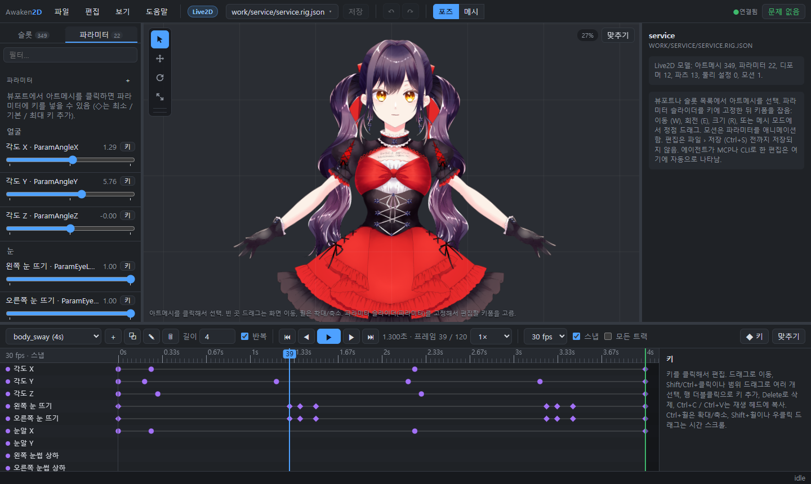

# Awaken2D

[English](README.md) · **한국어** · [日本語](README.ja.md)

Spine·Live2D 계열의 2D 리깅·애니메이션 툴킷. AI 에이전트가 사람만큼 쉽게 리그를 읽고, 고치고, 눈으로 확인하는
것이 목표.

- 모델은 텍스트 파일.
- 편집은 선언형 op.
- 결과는 헤드리스 렌더러로 확인.
- 사람은 같은 파일을 웹 에디터에서 편집.
- Spine·Live2D 데이터를 가져오고 다시 내보냄.


## 목차

- [기능](#기능)
- [빠른 시작](#빠른-시작)
- [아트 임포트와 자동 메시](#아트-임포트와-자동-메시)
- [Live2D](#live2d)
- [Spine](#spine)
- [에디터](#에디터)
- [MCP](#mcp)
- [데모 캐릭터 (본, IK, 스프링 본)](#데모-캐릭터-본-ik-스프링-본)
- [폴더 구조](#폴더-구조)
- [로드맵](#로드맵)

## 기능

| | |
|---|---|
| **텍스트 모델 포맷** | `*.rig.json`에 본, 슬롯, 가중치 메시, 파라미터, 애니메이션이 들어 있음. diff가 깔끔함. 명세는 [docs/FORMAT.md](docs/FORMAT.md) (`rig spec`으로 출력). |
| **선언형 op** | 모든 편집은 op. 원자적으로 적용되고, 실패하면 정확한 오류 메시지를 냄. 예: `addBone`은 월드 좌표 `start`/`end`를 받고, `addMesh`는 사각형·타원·다각형으로 메시를 만들고 가중치까지 자동으로 줌. `setKeys`는 키를 찍음. CLI·MCP·에디터가 같은 op를 씀. |
| **헤드리스 렌더러** | 결정적 소프트웨어 래스터라이저로 PNG를 만듦. 본·이름·메시·워프 오버레이, 애니메이션 컨택트 시트, 파라미터 시트를 그림. 에이전트가 결과를 직접 보고 확인할 수 있음. |
| **검증기** | 구조를 검사한 뒤, 모든 애니메이션을 샘플링해 접히는 삼각형과 NaN을 잡음. |
| **두 가지 타깃** | 모델은 Spine 모델(본, 가중치, 스킨, 컨스트레인트) 아니면 Live2D 모델(파라미터, 키폼, 디포머, 파츠). 다른 쪽 op는 거부되고, 에디터도 해당 도구만 보여줌. |
| **Spine 연동** | Spine 3.8/4.x export를 가져오고 다시 내보냄. 포즈가 공식 Spine 4.3 런타임과 일치. 편집 없이 왕복하면 원본 데이터 그대로. |
| **Live2D 연동** | Cubism 모델(model3 + moc3, 모션, 물리, 포즈)을 가져오고 moc3 + JSON으로 내보냄. 공식 Cubism Core와 프레임 단위로 일치. |
| **아트 임포트** | PSD/PSB·PNG 레이어가 슬롯이 되고, 그림을 따라 트레이스한 메시가 붙음. 메시 밀도는 레이어의 크기·모양·이름을 보고 정함. |
| **웹 에디터** | 기즈모, 메시·가중치 편집, 파라미터 키폼, 도프시트 타임라인, 실행 취소. 에이전트가 파일을 고치면 바로 반영됨. UI는 영어·한국어·일본어. |
| **MCP 서버** | 임포트, 편집, 검증, 렌더, 익스포트를 모두 도구로 제공. |

런타임 의존성 없음. TypeScript를 빌드 없이 Node ≥ 23.6에서 바로 실행.

## 빠른 시작

```bash
npm install
npm run example
```

```bash
npm run rig -- describe examples/mascot/mascot.rig.json
```

```bash
npm run rig -- sheet examples/mascot/mascot.rig.json --anim walk --frames 8 -o out/walk.png
```

```bash
npm run rig -- render examples/mascot/mascot.rig.json --overlay bones,names,mesh -o out/setup.png
```

파일에 적힌 op 적용 (`-`를 주면 stdin에서 읽음):

```bash
npm run rig -- apply my.rig.json ops.json
```

`npm run rig`만 실행하면 전체 명령 목록이 나옴.

## 아트 임포트와 자동 메시

```bash
npm run rig -- import art.psd out/model.rig.json --target live2d
```

PSD/PSB·PNG의 레이어 하나가 텍스처 메시를 가진 슬롯 하나가 됨.

- 블렌드 모드는 유지되고, 클리핑 마스크는 구워 넣음.
- 축소 임포트 가능.
- `--propose`를 주면 레이어 이름(영어·한국어)과 모양으로 스켈레톤도 제안함.

메시는 격자가 아니라 그림 외곽을 따라 트레이스. 레이어마다 정점 수를 따로 정함:

| 레이어 종류 | 메시 |
|---|---|
| 작은 파츠, 눈동자, 단추 | 외곽선만 |
| 얼굴, 손, 발 | 보통 밀도 |
| 머리카락, 옷, 치마, 팔다리, 가늘고 긴 모양 | 길이 방향으로 촘촘하게 |

- 판단 근거: 레이어 이름·그룹 경로(영어·일본어·한국어)와 그림 모양.
- 모든 메시는 그림을 빠짐없이 덮는지 검사함.
- Live2D 타깃은 더 촘촘하게 만듦.


유용한 옵션:

- `--mesh-density K`: 정점 수 배율.
- `--mesh-role hair=flexible,...`: 레이어 역할을 직접 지정.
- `--mesh grid` (또는 `--spacing PX`): 예전 격자 메시.

기존 메시를 다시 만들려면 `rig remesh <model> --all --plan`. 에디터에서는 메시 모드 › *자동…*.

## Live2D

```bash
npm run rig -- live2d-import model/name.model3.json out/name.rig.json
npm run rig -- live2d-export out/name.rig.json export/
```

- **임포트**: Cubism 런타임 모델을 읽음. model3.json + moc3, 텍스처, 모션, physics3, pose3, 표시 정보(cdi3).
- **평가**: Cubism과 똑같이 계산함.
  - 키폼, 워프·회전 디포머, 파츠, 글루, 그리기 순서 그룹을 그대로 유지.
  - 포즈는 공식 Cubism Core와 일치하고, 로컬 도구로 프레임 단위 비교함.
  - 모션·물리·포즈 페이드는 Cubism Framework처럼 재생.
- **편집 (Cubism 방식)**:
  1. 아트메시 선택.
  2. 파라미터 목록의 ◇로 최소·기본·최대 키 추가.
  3. 슬라이더 아래 키 점을 클릭한 뒤, 기즈모나 정점으로 모양 잡기.
- **조합(Combination)**: 파라미터 2~3개(예: AngleX × AngleY)에 키가 걸린 오브젝트는 2D 패드와 격자점별 키폼 칩이
  나옴.
- **파라미터 시트**: 파라미터가 무엇을 움직이는지 한 장에 보여줌.
  `rig param-sheet <model> --param ParamAngleX --param2 ParamAngleY --steps 3`.


## Spine

```bash
npm run rig -- spine-import skeleton.json out/skeleton.rig.json
npm run rig -- spine-export out/skeleton.rig.json export/
```

- **임포트/익스포트**:
  - Spine 3.8/4.x export(JSON + 아틀라스)를 가져옴.
  - Spine 4.x JSON + 아틀라스 + 이미지로 내보냄. Spine의 Import Data로 바로 열 수 있음.
- **Spine과 같은 계산**:
  - 본 inherit 모드;
  - 스킨 (스킨 본·컨스트레인트 포함);
  - 링크드 메시;
  - 클리핑·바운딩 박스;
  - 투 컬러 틴트;
  - IK / 트랜스폼 / 패스 / 물리 / 슬라이더 컨스트레인트 (Spine 순서대로);
  - 각각의 타임라인.

  Spine 예제 기준, 물리 포함 공식 Spine 4.3 런타임과 약 0.05 단위 이내로 일치.
- **정확한 왕복**: 편집하지 않은 데이터는 임포트한 그대로 다시 써짐.
- **이벤트 사운드**:
  - 에디터에서 재생됨 (🔇로 음소거).
  - 이벤트 탭에서 사운드 유무가 보임.
  - *사운드 파일 선택…*: wav/ogg/mp3를 모델 옆으로 복사해서 이벤트에 연결.
  - 익스포트할 때 사운드도 같이 복사됨.
- **리전 어태치먼트**: Spine처럼 사각형 그대로 유지. `--mesh auto`를 주면 자동 메시로 바뀜.

## 에디터

```bash
npm run editor
```

http://127.0.0.1:5178/ 을 열면 됨. 다른 폴더의 모델을 편집하려면 `-- --root <폴더>`를 붙임. 서버는 localhost에서만
열리고, root 아래 파일만 읽고 씀.



**파일과 저장**
- 파일 열기: 헤더의 파일 이름을 누르거나 파일 › 열기 (Ctrl+O).
- 파일 메뉴에는 그 밖에:
  - Spine / Live2D 임포트·익스포트;
  - 저장 (Ctrl+S);
  - 다른 이름으로 저장 (Ctrl+Shift+S; 이미지 경로를 새 폴더에 맞게 고침);
  - 저장된 상태로 되돌리기.
- 열기 목록에서 모델을 우클릭하면 삭제. 그 모델만 쓰던 이미지와 함께 `.awaken2d-trash/`로 옮겨짐.
- 저장 전 편집은 서버의 작업 사본에만 들어감.
  - ●는 저장 안 된 파일 표시.
  - 페이지를 새로고침해도 작업 사본은 남음.
  - *편집할 때마다 자동 저장* (또는 `serve --autosave`)을 켜면 편집할 때마다 바로 디스크에 씀.
- 작업 중 에이전트가 파일을 고치면:
  - 저장 안 된 편집이 없으면 자동으로 다시 불러옴.
  - 있으면 배너가 뜸: *디스크 버전 불러오기* 또는 *내 편집 유지*. *내 편집 유지*를 고르면 다음 저장 때 디스크 버전을
    덮어씀.
- 경로(열기, 임포트, 익스포트, 다른 이름으로 저장)는 직접 입력하지 않고 파일 선택 창에서 고름.

**포즈와 애니메이션**
- 도구:
  - 선택 `Q`, 이동 `W`, 회전 `E`, 크기 `R`. 기즈모는 축 화살표, 링, 축 박스, 균등 크기용 중앙 점.
  - 새 본 `B`: 관절에서 끝까지 드래그. 새 본 아래 메시를 바인딩할지 대화상자에서 물어봄. Shift를 누르면 스냅.
- 메시가 본 따라가기 (`T`):
  - 켜면 셋업에서 본을 옮길 때 연결된 그림도 같이 움직임.
  - 끄면 스켈레톤만 움직여서 그림에 맞출 수 있음.
- 셋업(애니메이션 선택 없음)에서는 편집이 기본 포즈를 바꿈. 애니메이션을 고르면 재생 헤드 위치에 키를 찍음. `K`는
  선택한 본의 현재 포즈를 키로 찍음.
- 타임라인 (도프시트):
  - 애니메이션 채널마다 한 줄. 그룹으로 묶이고 접을 수 있음.
  - 범위 선택으로 키를 골라 드래그. 프레임 격자(24/30/60 fps)에 스냅됨. 키 복사·붙여넣기 가능.
  - 이징: 선형, 계단, ease in/out, 커브 미리보기가 있는 사용자 베지어. 키 모양으로 이징이 구분됨.
  - 위쪽 바에서 길이와 반복을 정하고, 애니메이션을 복제·이름 변경·삭제.
- 속성: 필드 이름을 드래그하면 값이 바뀜 (Shift는 미세 조정). 파츠는 색, 불투명도, 블렌드, 클리핑, 그리기 순서.

**메시와 가중치**
- 메시 모드 (`2`, Spine 방식):
  - *수정*: 정점 이동. *만들기*: 정점 추가. *삭제*: 정점 제거.
  - *자동…*: 임포터의 자동 메시. 역할과 밀도를 조절할 수 있음.
  - *추적…*: 그림 외곽선을 따라 메시를 만듦.
  - *생성*: 외곽선 안을 고른 간격의 정점으로 채움.
  - *초기화*: 이미지 사각형으로 되돌림.
  - 모두 실시간 미리보기. 가중치, 블렌드 셰이프, 조합 셰이프가 그대로 이어짐.
- Live2D 아트메시의 메시 모드 (Cubism 방식):
  - *키폼 모양*: 고정한 키의 키폼 모양을 잡음.
  - *메시 편집*: 메시 자체를 고침. 모든 키폼이 따라옴. *자동 메시…* (Cubism 자동 메시 생성 프리셋), *자동 연결*,
    *4분할* 포함.
- 가중치 모드 (`3`):
  - *직접*: 선택한 정점에 값 입력.
  - *브러시*: 더하기, 빼기, 값으로 설정, 부드럽게.
  - *부드럽게*, *자동*, *교환…*, *정리*는 선택 영역이나 메시 전체에 적용.
  - 히트맵은 고른 본의 가중치를, 파이 오버레이는 정점마다 모든 본의 가중치를 보여줌.

**공통**
- 이름 바꾸기: F2. 삭제: Shift+Del (확인 후). 본을 지우면 자식과 가중치는 부모 본이 넘겨받음.
- 실행 취소·다시 실행 (Ctrl+Z / Ctrl+Shift+Z)은 에디터 밖에서 한 편집도 포함. 에이전트가 고친 것도 UI에서 되돌릴 수
  있음.
- Space로 재생·일시정지, `F`로 화면 맞춤. 도움말 › 단축키에 전체 키 목록이 있음.
- UI 언어: English, 한국어, 日本語 (도움말 › 언어). 본·슬롯·파라미터·파일 이름은 번역하지 않음.
- 브라우저가 TypeScript 코어를 그대로 실행함. 서버가 타입만 즉석에서 지우므로 빌드 단계가 없음.

## MCP

이 폴더의 `.mcp.json`이 Claude Code에 서버를 등록함. 다른 클라이언트에서는:

```json
{ "command": "node", "args": ["--disable-warning=ExperimentalWarning", "<repo>/src/mcp/server.ts"] }
```

| 도구 | |
|---|---|
| 모델 | `rig_spec`, `rig_new`, `rig_describe`, `rig_validate`, `rig_apply` |
| 보기 | `rig_render`, `rig_sheet`, `rig_param_sheet` |
| 임포트 | `rig_import`, `rig_propose_bones`, `rig_spine_import`, `rig_live2d_import` |
| 익스포트 | `rig_spine_export`, `rig_live2d_export` |

에이전트의 일반적인 순서:

1. `rig_spec`
2. `rig_new` 또는 임포트 도구
3. `rig_apply` (`preview`와 함께)
4. `rig_validate`
5. `rig_sheet`
6. 3번부터 반복.

## 데모 캐릭터 (본, IK, 스프링 본)

`npm run example:character`는 타깃 없는 모델 전용 기능을 쓰는 데모를 다시 만듦.

1. PSD를 그림.
2. 스켈레톤을 제안받으며 임포트.
3. IK, 스프링, 애니메이션, 얼굴 리그를 추가.

스프링 본은 Spine·Live2D 어느 쪽으로도 내보내지지 않아서, 이 모델에는 타깃이 없음.

```bash
npm run rig -- import examples/psd-demo/character.psd out/character.rig.json --target none --propose --ik --physics
```

- **IK** (`--ik`): 팔다리에 투 본 IK가 붙음. 골반을 내려도 발은 땅에 붙어 있음. 손 타깃을 월드 좌표로 키 찍으면 팔이
  따라감 ([animate.ops.json](examples/psd-demo/animate.ops.json)).

  
- **스프링 본** (`--physics`): 꼬리가 3본짜리 감쇠 스프링 체인이 됨. 키 없이 골반 움직임만으로 흔들림. 주파수, 감쇠,
  중력, 관성, 각도 제한, 바람을 설정할 수 있고, 바람은 키로 찍을 수 있음.

  

## 폴더 구조

```
src/core     포맷 타입, 수학, 포즈/스키닝, 애니메이션, 지오메트리, 자동 가중치, 메시 플래너, 검증, op,
             Spine 런타임 포팅 (spine.ts), Live2D 평가 (live2d*.ts)
src/import   PSD 리더/라이터, 레이어 임포트, 스켈레톤 제안
src/spine    Spine 아틀라스, JSON 임포트/익스포트, 파일 입출력
src/live2d   moc3 리더/라이터, model3/motion3/physics3 임포트/익스포트
src/render   PNG 코덱, 래스터라이저, 비트맵 폰트, 프레임 / 컨택트 시트 / 파라미터 시트
src/cli      `rig` 명령
src/mcp      stdio MCP 서버
src/web      에디터 HTTP 서버, 검증 워커, 파일 선택기
web/         에디터 (브라우저 TypeScript, WebGL)
examples     make-mascot.ts는 op만으로 캐릭터를 만듦. make-psd.ts는 레이어 데모 PSD를 그림
```

## 로드맵

- [x] 포맷, 런타임, 헤드리스 렌더러, CLI, MCP 서버
- [x] 아트 임포트 (PSD / 레이어 PNG), 스켈레톤 제안, 자동 메시
- [x] 웹 에디터 (에이전트 편집 실시간 반영, 실행 취소, 다국어 UI)
- [x] Live2D식 파라미터, 조합 키폼, IK, 스프링 본
- [x] Spine 임포트/익스포트: 모든 컨스트레인트, 스킨, 이벤트와 사운드, 바운딩 박스
- [x] Live2D 임포트/익스포트: moc3, 키폼과 디포머, 모션, 물리, 포즈
- [ ] 런타임 플레이어 (웹, Unity/Godot)
- [ ] 스프링 본 충돌
