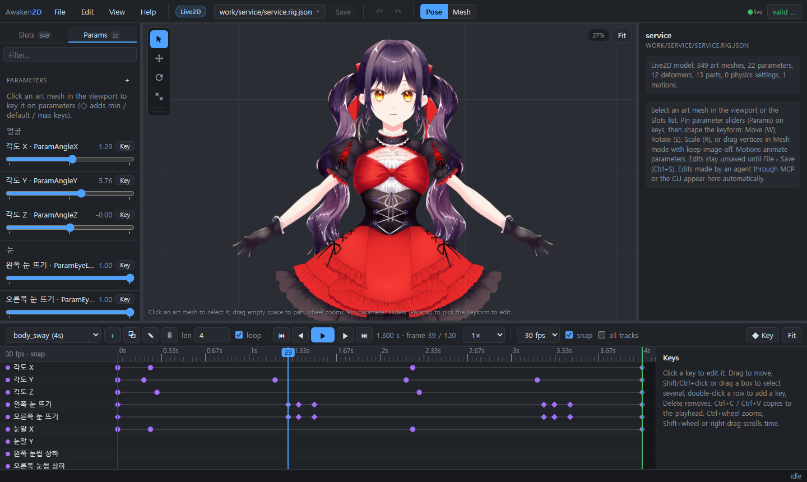

# Awaken2D

**English** · [한국어](README.ko.md) · [日本語](README.ja.md)

A 2D rigging and animation toolkit for AI agents, in the spirit of Spine and Live2D. Agents can read, edit and
check a rig as easily as a person can. Models are text, edits are declarative ops, and a headless renderer shows
the result. People work on the same file in a web editor. Spine and Live2D data go in and come back out.


## Contents

- [Features](#features)
- [Quick start](#quick-start)
- [Art import and automatic meshes](#art-import-and-automatic-meshes)
- [Live2D](#live2d)
- [Spine](#spine)
- [Editor](#editor)
- [MCP](#mcp)
- [Demo character (bones, IK, spring bones)](#demo-character-bones-ik-spring-bones)
- [Layout](#layout)
- [Roadmap](#roadmap)

## Features

| | |
|---|---|
| **Text model format** | `*.rig.json` holds bones, slots, weighted meshes, parameters and animations. It diffs cleanly and is documented in [docs/FORMAT.md](docs/FORMAT.md) (`rig spec` prints it). |
| **Declarative ops** | Every edit is an op, applied atomically with precise error messages. For example, `addBone` takes world `start`/`end` points, `addMesh` builds a mesh from a rect, ellipse or polygon and weights it automatically, and `setKeys` keys an animation. The CLI, MCP server and editor all use the same ops. |
| **Headless renderer** | A deterministic software rasterizer writes PNGs. It can draw bone, name, mesh and warp overlays, contact sheets of an animation, and parameter sheets, so an agent can look at its own work. |
| **Validator** | Checks the structure, then samples every animation for folding triangles and NaNs. |
| **Two targets** | A model is either a Spine model (bones, weights, skins, constraints) or a Live2D model (parameters, keyforms, deformers, parts). Ops for the other kind are refused, and the editor only shows that kind's tools. |
| **Spine interop** | Imports Spine 3.8/4.x exports and writes them back. Poses match the official Spine 4.3 runtime, and a round trip without edits gives back the original data. |
| **Live2D interop** | Imports a Cubism model (model3 + moc3, motions, physics, pose) and exports moc3 + JSON. Poses match the official Cubism Core frame by frame. |
| **Art import** | PSD/PSB or PNG layers become slots with meshes traced around the art. Each mesh's density depends on the layer's size, shape and name. |
| **Web editor** | Gizmos, mesh and weight editing, parameter keyforms, a dope-sheet timeline and undo. Edits an agent makes to the file show up live. The UI is in English, Korean and Japanese. |
| **MCP server** | Import, edit, validate, render and export, all as tools. |

No runtime dependencies. TypeScript runs directly on Node ≥ 23.6 with no build step.

## Quick start

```bash
npm install
npm run example
```

```bash
npm run rig -- describe examples/mascot/mascot.rig.json
```

```bash
npm run rig -- sheet examples/mascot/mascot.rig.json --anim walk --frames 8 -o out/walk.png
```

```bash
npm run rig -- render examples/mascot/mascot.rig.json --overlay bones,names,mesh -o out/setup.png
```

To apply ops from a file, pass the file (or `-` to read from stdin):

```bash
npm run rig -- apply my.rig.json ops.json
```

`npm run rig` with no arguments lists every command.

## Art import and automatic meshes

```bash
npm run rig -- import art.psd out/model.rig.json --target live2d
```

Each PSD/PSB or PNG layer becomes a slot with a textured mesh. Blend modes are kept, clipping masks are baked in,
and the art can be downscaled. With `--propose`, Awaken2D also proposes a skeleton from the layer names (English or
Korean) and shapes.

Meshes are traced around the art, not laid out as a grid. Each layer gets its own vertex budget:

| Kind of layer | Mesh |
|---|---|
| Small parts, pupils, buttons | An outline only |
| Faces, hands, feet | A medium mesh |
| Hair, cloth, skirts, limbs, long thin shapes | Dense along their length |

Awaken2D decides this from the layer's name and group path (English, Japanese or Korean) and from its shape. Every
mesh is checked to cover all of the art. Live2D targets get denser meshes.


Useful flags:

- `--mesh-density K` scales the vertex count.
- `--mesh-role hair=flexible,...` overrides a layer's role.
- `--mesh grid` (or `--spacing PX`) brings back the old grid mesh.

To rebuild existing meshes, use `rig remesh <model> --all --plan`. In the editor, Mesh mode › *Auto…* does the same.

## Live2D

```bash
npm run rig -- live2d-import model/name.model3.json out/name.rig.json
npm run rig -- live2d-export out/name.rig.json export/
```

- **Import** reads a Cubism runtime model: model3.json + moc3, textures, motions, physics3, pose3 and display
  info (cdi3).
- **Evaluation** matches Cubism exactly. Awaken2D keeps Cubism's keyforms, warp and rotation deformers, parts, glue
  and draw-order groups, and poses like the official Cubism Core; tools compare them frame by frame. Motions,
  physics and pose fades play like the Cubism Framework.
- **Editing** works Cubism style:
  1. Select an art mesh.
  2. ◇ in the Params list adds min / default / max keys.
  3. Click a key dot under a slider, then shape the mesh with the gizmo or its vertices.
- **Combinations**: an object keyed on two or three parameters (for example AngleX × AngleY) gets a 2D pad and a
  keyform chip per grid point.
- **Parameter sheets** show what a parameter does:
  `rig param-sheet <model> --param ParamAngleX --param2 ParamAngleY --steps 3`.


## Spine

```bash
npm run rig -- spine-import skeleton.json out/skeleton.rig.json
npm run rig -- spine-export out/skeleton.rig.json export/
```

- **Import** reads a Spine 3.8/4.x export (JSON + atlas). **Export** writes Spine 4.x JSON + atlas + images, ready
  for Spine's Import Data.
- **Evaluated like Spine:**
  - bone inherit modes;
  - skins, including skin bones and constraints;
  - linked meshes;
  - clipping and bounding box attachments;
  - two-color tint;
  - the IK, transform, path, physics and slider constraints, run in Spine's order;
  - their timelines.

  On the Spine examples, poses stay within about 0.05 units of the official Spine 4.3 runtime, physics included.
- **Exact round trip**: data you did not edit is written back exactly as it was imported.
- **Event sounds**:
  - Sounds play in the editor; 🔇 mutes them.
  - The Events tab shows which events have sounds.
  - *Choose sound file…* copies a wav/ogg/mp3 next to the model and links it to the event.
  - Export copies the sounds too.
- **Region attachments** stay quads, exactly as in Spine. `--mesh auto` turns them into automatic meshes.

## Editor

```bash
npm run editor
```

Open http://127.0.0.1:5178/. To edit models in another folder, add `-- --root <folder>`. The server only listens
on localhost and only reads and writes files under the root.



**Files and saving**
- Open a file from the file name in the header, or with File › Open (Ctrl+O). The File menu also imports and
  exports Spine / Live2D and has Save (Ctrl+S), Save As (Ctrl+Shift+S; image paths are rewritten for the new
  folder) and Revert to Saved. Right-click a model in the Open list to delete it. It moves to `.awaken2d-trash/`
  together with the images only it used.
- Edits go to a working copy on the server until you save. ● marks unsaved files, and the working copy survives
  a page reload. *Auto-save every edit* (or `serve --autosave`) writes each edit straight to disk instead.
- Agent edits while you work:
  - A file with no unsaved edits reloads when it changes on disk.
  - If you have unsaved edits, a banner offers *Load disk version* or *Keep my edits*. With *Keep my edits*, the
    next save overwrites the disk version.
- Paths (Open, Import, Export, Save As) are picked in a file dialog, never typed.

**Posing and animation**
- Tools:
  - Select `Q`, Move `W`, Rotate `E` and Scale `R`. The gizmo has axis arrows, a ring, axis boxes and a center dot
    for uniform scale.
  - New bone `B`: drag from joint to tip. The dialog offers to bind the meshes under the new bone. Hold Shift to
    snap.
- Meshes follow bones (`T`). When this is on, moving a bone in Setup carries the art bound to it. Turn it off to
  fit the skeleton to the art.
- In Setup (no animation selected), edits change the rest pose. With an animation selected, edits key at the
  playhead, and `K` keys the selected bone's current pose.
- Timeline (dope sheet):
  - One row per animated channel, grouped and collapsible.
  - Box-select keys and drag them; they snap to the frame grid at 24, 30 or 60 fps. Copy and paste keys.
  - Easing can be linear, stepped, ease in/out or a custom bezier with a curve preview. Key shapes show the
    easing.
  - The bar above the timeline sets the length and looping, and duplicates, renames or deletes animations.
- Properties: drag a field's label to scrub its value (Shift for fine steps). Parts have color, opacity, blend
  mode, clipping and draw order.

**Meshes and weights**
- Mesh mode (`2`), Spine style:
  - *Modify*, *Create* and *Delete* vertices.
  - *Auto…* is the importer's automatic mesh, with adjustable role and density.
  - *Trace…* traces an outline around the art. *Generate* fills the outline with evenly spaced vertices.
  - *Reset* goes back to the image rectangle.
  - All of these are previewed live. Weights, blend shapes and combination shapes carry over.
- Live2D art meshes in Mesh mode, Cubism style:
  - *Shape keyform* shapes the mesh at the pinned keys.
  - *Edit mesh* changes the mesh itself; every keyform follows. It includes *Auto mesh…* (Cubism's Automatic Mesh
    Generator presets), *Auto connect* and *Quartering*.
- Weights mode (`3`):
  - *Direct*: set a value on the selected vertices.
  - *Brush*: add, subtract, set or smooth.
  - *Smooth*, *Auto*, *Swap…* and *Prune* work on the selection or the whole mesh.
  - A heatmap shows the chosen bone's weights, and a pie overlay shows every bone at each vertex.

**General**
- Rename with F2. Delete with Shift+Del, after a confirmation; deleting a bone hands its children and weights to
  its parent.
- Undo and redo (Ctrl+Z / Ctrl+Shift+Z) cover edits made outside the editor too, so you can undo an agent's
  change from the UI.
- Play or pause with Space. `F` fits the view. Help › Keyboard Shortcuts lists all keys.
- UI language: English, 한국어, 日本語 (Help › Language). Names of bones, slots, parameters and files are never
  translated.
- The browser runs the TypeScript core directly. The server strips types on the fly, so there is no build step.

## MCP

`.mcp.json` registers the server for Claude Code in this folder. For other clients:

```json
{ "command": "node", "args": ["--disable-warning=ExperimentalWarning", "<repo>/src/mcp/server.ts"] }
```

| Tools | |
|---|---|
| Model | `rig_spec`, `rig_new`, `rig_describe`, `rig_validate`, `rig_apply` |
| Look | `rig_render`, `rig_sheet`, `rig_param_sheet` |
| Import | `rig_import`, `rig_propose_bones`, `rig_spine_import`, `rig_live2d_import` |
| Export | `rig_spine_export`, `rig_live2d_export` |

A typical agent loop:

1. `rig_spec`
2. `rig_new` or an import tool
3. `rig_apply` (with `preview`)
4. `rig_validate`
5. `rig_sheet`
6. Repeat from step 3.

## Demo character (bones, IK, spring bones)

`npm run example:character` rebuilds a demo that uses the untargeted features: it paints a PSD, imports it with a
proposed skeleton, and adds IK, springs, animations and a face rig. The model has no target, because spring bones
export to neither Spine nor Live2D.

```bash
npm run rig -- import examples/psd-demo/character.psd out/character.rig.json --target none --propose --ik --physics
```

- **IK** (`--ik`): arms and legs get two-bone IK. Drop the hip and the feet stay planted; key a hand target in
  world coordinates and the arm follows ([animate.ops.json](examples/psd-demo/animate.ops.json)).

  
- **Spring bones** (`--physics`): the tail becomes a 3-bone damped-spring chain. Nothing keys it; it swings from the
  hip motion. Frequency, damping, gravity, inertia, angle limit and wind can all be set, and wind can be keyed.

  

## Layout

```
src/core     format types, math, pose/skinning, animation, geometry, auto weights, mesh planner, validate, ops,
             Spine runtime port (spine.ts), Live2D evaluation (live2d*.ts)
src/import   PSD reader/writer, layer import, skeleton proposal
src/spine    Spine atlas, JSON import/export, file I/O
src/live2d   moc3 reader/writer, model3/motion3/physics3 import/export
src/render   PNG codec, rasterizer, bitmap font, frame / contact sheet / parameter sheet
src/cli      `rig` command
src/mcp      stdio MCP server
src/web      editor HTTP server, validation worker, file picker
web/         editor (browser TypeScript, WebGL)
examples     make-mascot.ts builds a character purely from ops; make-psd.ts paints a layered demo PSD
```

## Roadmap

- [x] Format, runtime, headless renderer, CLI, MCP server
- [x] Art import (PSD / layered PNG), skeleton proposal, automatic meshes
- [x] Web editor with live reload of agent edits, undo, localized UI
- [x] Live2D-style parameters, combination keyforms, IK, spring bones
- [x] Spine import/export: every constraint type, skins, events and sounds, bounding boxes
- [x] Live2D import/export: moc3, keyforms and deformers, motions, physics, pose
- [ ] Runtime players (web, Unity/Godot)
- [ ] Spring-bone collision
